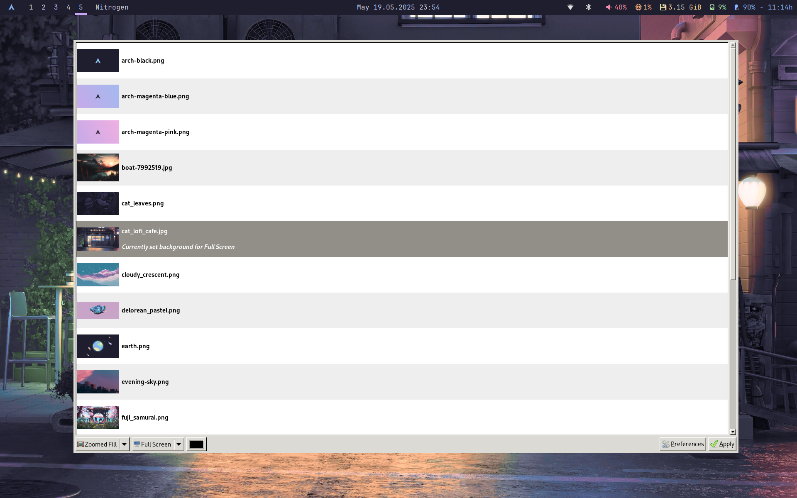
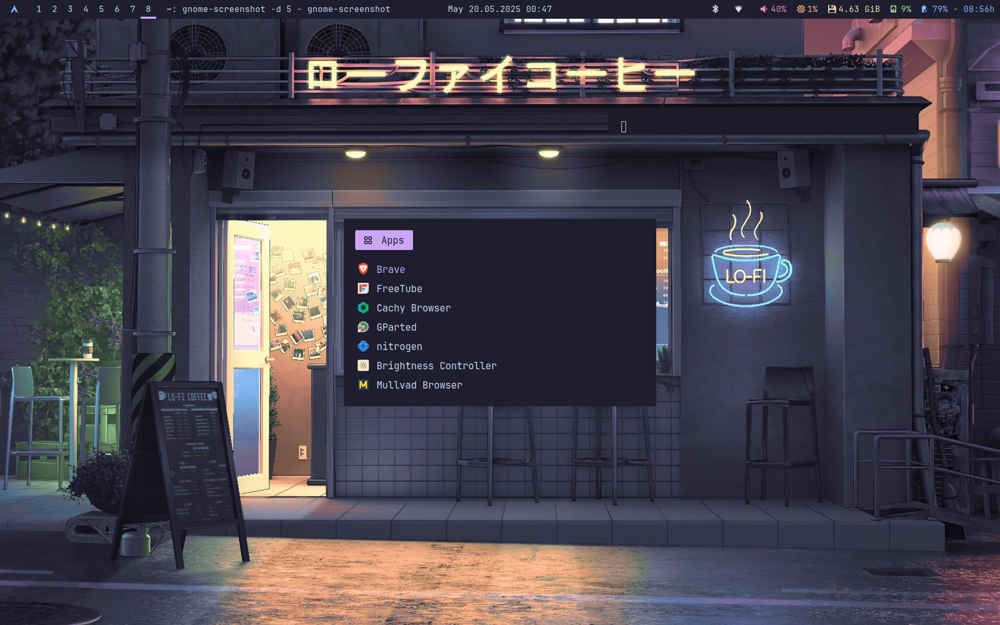

# My Dotfiles

This repository contains my personal configuration files for various applications and tools that I use on my minimal laptop build.
(Ignore the listofapps.txt)

## Installation

To install my dotfiles, you can use the following commands:

```bash
# Clone the repository
git clone https://github.com/blvckcvbe/dotfilesi3 ~/.dotfilesi3

# Change to the dotfiles directory
cd ~/.dotfilesi3
```
## Usage

After cloning the dotfiles, copy them, go to your home directory and paste it in. You can customize them further as per your needs.
<!--
- **i3**: Window manager configuration
- **nvim**: Text editor configuration
- **fish**: Shell configuration
-->
Feel free to modify any of the files to suit your workflow.

## Screenshots





